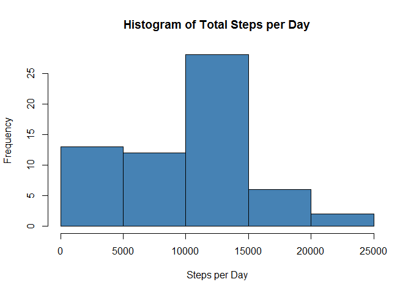
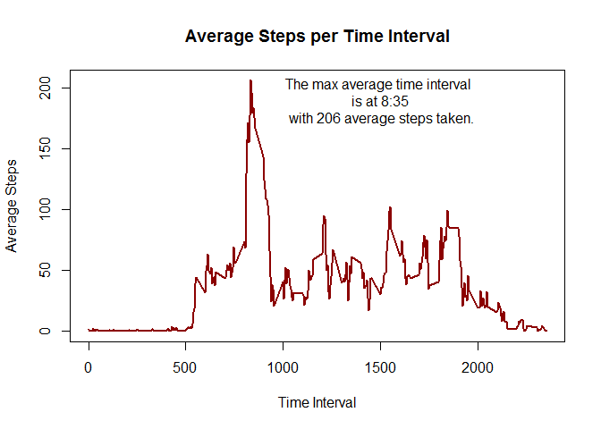
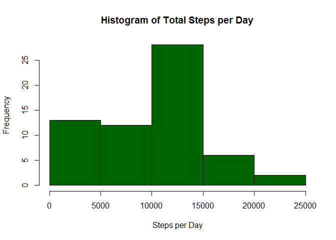
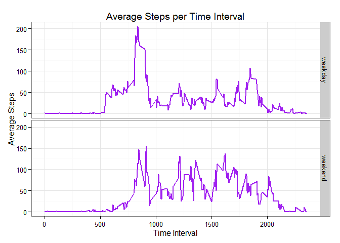

# Reproducible Research: Peer Assessment 1

This R script loads, processes, and explores data from a personal activity 
monitoring device that is tracking steps per day at 5 minute time intervals. 
The data is explored by calculating the mean and median steps per day and 
displaying them in a histogram. The steps per time interval is also viewed in 
a line chart, noting the time interval that has the highest amount of steps 
on average across days. Next the NA values are replaced with imputed numbers 
using the median time interval and the mean, median, and histogram of the 
steps per day is checked on the new data. Finally, the steps per time interval 
are compared for weekdays and weekends using line charts to see if there is 
a notable difference in daily activity pattern.


## Loading and preprocessing the data
The first thing I do is load the necessary pacakges. 


```r
## load packages
library(ggplot2)
library(dplyr)
```

```
## 
## Attaching package: 'dplyr'
## 
## The following object is masked from 'package:stats':
## 
##     filter
## 
## The following objects are masked from 'package:base':
## 
##     intersect, setdiff, setequal, union
```
Then I unzip the folder to extract the data for analysis. 


```r
## unzip the download and extract files to working directory
unzip("C:/Users/Jared/RepData_PeerAssessment1/activity.zip")
```
Next I load the data into R.


```r
## load the data
activity.data <- read.csv("activity.csv", header = TRUE)
```
Then I preprocess the data by removing the NAs, calculating the total steps 
taken per day, and storing a new data frame with the total steps per day.


```r
## preprocess the data and calculate total steps taken per day
activity.spd <- activity.data %>%
        select(date, steps) %>%
        group_by(date) %>%
        summarise(spd = sum(steps, na.rm = TRUE))
```


## What is mean total number of steps taken per day?
It is useful to explore data with visualizations and summary stastics. 
First, consider a histogram of the total steps per day.


```r
## create a histogram of the total steps taken per day
hist(activity.spd$spd, main = "Histogram of Total Steps per Day", 
     xlab = "Steps per Day", col = "steelblue")
```

 

Calculating the mean of the total steps per day provides additional insight.


```r
## calculate the mean of the total steps taken per day
activity.spd.mean <- mean(activity.spd$spd)
activity.spd.mean
```

```
## [1] 9354.23
```
It is also helpful to consider the median, especially if the data are non-normal.


```r
## calculate the median of the total steps taken per day
activity.spd.median <- median(activity.spd$spd)
activity.spd.median
```

```
## [1] 10395
```
The mean total number of steps taken per day is 9354 and the 
median is 10395.


## What is the average daily activity pattern?
Process and store a new data frame of the steps per time interval, after removing
the NAs.


```r
## calculate average steps per time interval
activity.spi <- activity.data %>%
        select(interval, steps) %>%
        group_by(interval) %>%
        summarise(spi = mean(steps, na.rm = TRUE))
```

Create a line chart that illustrates the average daily activity pattern of
steps per time interval.


```r
## create a line chart of the average steps per time interval
with(activity.spi, plot(interval, spi, type = "l", 
        main = "Average Steps per Time Interval", 
        ylab = "Average Steps", xlab = "Time Interval", 
        col = "darkred", lwd = 2))

text(1500, 190, paste("The max average time interval \n is at", 
        sub("(\\d+)(\\d{2})", "\\1:\\2", 
                activity.spi[with(activity.spi, which.max(spi)), 1]), "\n with", 
        round(activity.spi[with(activity.spi, which.max(spi)), 2], 0), 
        "average steps taken."))
```

 

The maximum average time interval is at 8:35 with 206 steps taken on
average.

## Imputing missing values
Check to see how many missing values there are.


```r
## calculate the number of rows with missing values
rows.na <- nrow(activity.data[is.na(activity.data$steps),])
rows.na
```

```
## [1] 2304
```

There are 2304 rows with missing values.  
Then apply a strategy for imputing numbers into the missing values. The strategy
is to use the median steps per time interval. 


```r
## calculate median steps per time interval
activity.spi.med <- activity.data %>%
        select(interval, steps) %>%
        group_by(interval) %>%
        summarise(spi = median(steps, na.rm = TRUE))

## calculate average steps per time interval
activity.imputed <- merge(activity.data, activity.spi.med)

## create a new data set and impute the median steps per time interval 
## for missing values
activity.imputed$steps[is.na(activity.imputed$steps)] <- 
        with(activity.imputed, 
        ave(steps, interval, FUN = function(x) 
                median(x, na.rm = TRUE)))[is.na(activity.imputed$steps)]
```


Recalculate the total steps per day with the imputed values. Consider the mean,
median, and a histogram of the total steps with these changes.


```r
## calculate total steps taken per day
activity.im.spd <- activity.imputed %>%
        select(date, steps) %>%
        group_by(date) %>%
        summarise(spd = sum(steps))

## calculate the mean of the total steps taken per day
activity.im.mean <- mean(activity.im.spd$spd)

## calculate the median of the total steps taken per day
activity.im.median <- median(activity.im.spd$spd)

activity.im.mean
```

```
## [1] 9503.869
```

```r
activity.im.median
```

```
## [1] 10395
```

```r
## create a histogram of the total steps taken per day
hist(activity.im.spd$spd, main = "Histogram of Total Steps per Day", 
     xlab = "Steps per Day", col = "darkgreen")
```

 

The median of 10395 is the same for the original data set and 
the data set with imputed values. However, the mean of the original data set is
9354 and the mean of the data set with imputed values is
9504. The mean is pulled up by replacing the NAs with 
imputed values calculated using median time interval.

## Are there differences in activity patterns between weekdays and weekends?

Using the data set with imputed values, Create a new variable which identifies 
wether a day falls on a weekday or weekend.


```r
## create a new data frame with a factor weekday indicator (wdi)
activity.full <- activity.imputed %>%
        mutate(wdi = factor(ifelse(weekdays(as.Date(activity.imputed$date), 
        abbreviate = TRUE) == "Sat" | weekdays(as.Date(activity.imputed$date), 
        abbreviate = TRUE) == "Sun", "weekend", "weekday")))


## calculate average steps per time interval by weekday indicator
activity.full.spi <- activity.full %>%
        select(interval, wdi, steps) %>%
        group_by(interval, wdi) %>%
        summarise(spi = mean(steps, na.rm = TRUE))
```

Create a chart that illustrates the difference in steps per interval for weekdays
versus weekends.


```r
## create plot using ggplot (grammar of graphics)
## plot the average steps per time interval for weekend vs weekday
g <- ggplot(activity.full.spi, aes(interval, spi)) + 
        theme_bw() + 
        geom_line(size = 1, col = "purple") + 
        facet_grid(wdi ~ .) +
        ggtitle("Average Steps per Time Interval") + 
        ylab("Average Steps") + xlab("Time Interval") 
print(g)
```

 

We can see from the charts that steps per interval exhibits a different pattern 
on weekends compared to weekdays. On weekdays there is a prominent spike in 
steps at and around 8:35am. On weekends the spike is less apparent and the variation
in the steps per interval is less dramatic. The next step will be to identify the 
reasons why there is a different pattern.   


